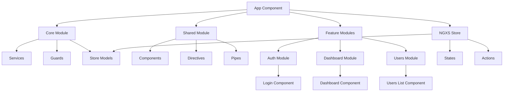
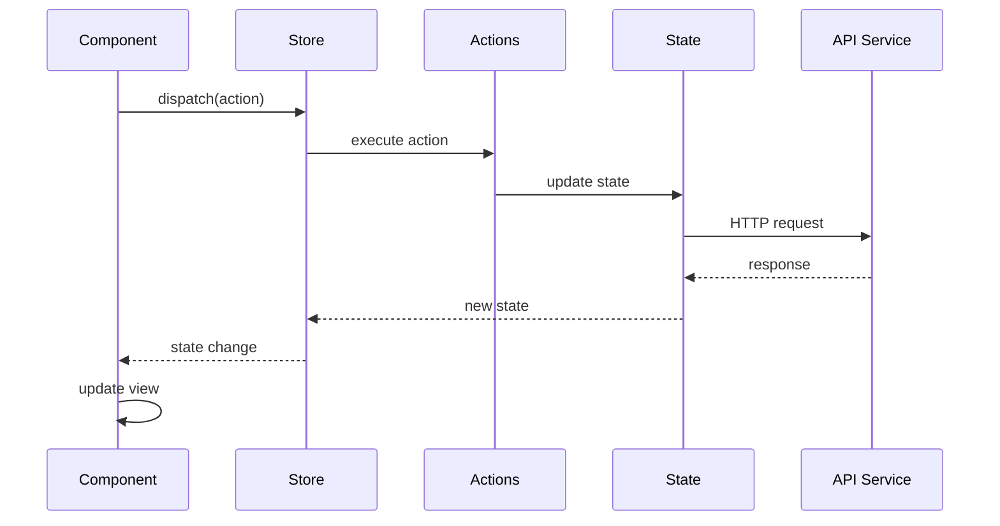
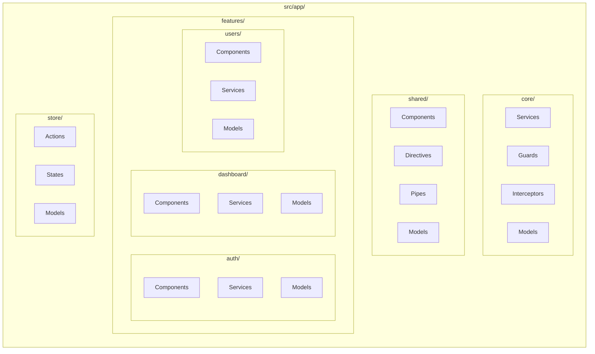
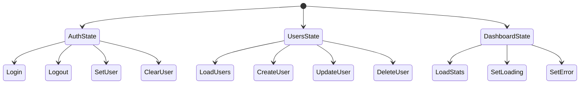
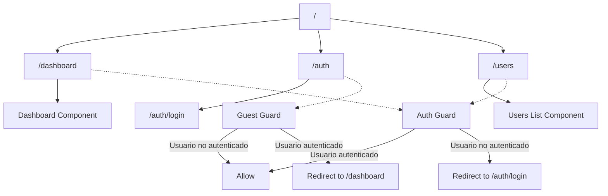

# Diagrama de Arquitectura - Proyecto Fidelización

## Estructura de Módulos

```mermaid
graph TB
    App[App Component] --> Core[Core Module]
    App --> Shared[Shared Module]
    App --> Features[Feature Modules]
    App --> Store[NGXS Store]
    
    Core --> Services[Services]
    Core --> Guards[Guards]
    Core --> Models[Models]
    
    Shared --> Components[Components]
    Shared --> Directives[Directives]
    Shared --> Pipes[Pipes]
    
    Features --> Auth[Auth Module]
    Features --> Dashboard[Dashboard Module]
    Features --> Users[Users Module]
    
    Store --> States[States]
    Store --> Actions[Actions]
    Store --> Models[Store Models]
    
    Auth --> Login[Login Component]
    Dashboard --> DashboardComp[Dashboard Component]
    Users --> UsersList[Users List Component]
```

## Flujo de Datos con NGXS

```mermaid
sequenceDiagram
    participant C as Component
    participant S as Store
    participant A as Actions
    participant ST as State
    participant API as API Service
    
    C->>S: dispatch(action)
    S->>A: execute action
    A->>ST: update state
    ST->>API: HTTP request
    API-->>ST: response
    ST-->>S: new state
    S-->>C: state change
    C->>C: update view
```

## Estructura de Carpetas Detallada

```mermaid
graph LR
    subgraph "src/app/"
        subgraph "core/"
            CS[Services]
            CG[Guards]
            CI[Interceptors]
            CM[Models]
        end
        
        subgraph "shared/"
            SC[Components]
            SD[Directives]
            SP[Pipes]
            SM[Models]
        end
        
        subgraph "features/"
            subgraph "auth/"
                AC[Components]
                AS[Services]
                AM[Models]
            end
            
            subgraph "dashboard/"
                DC[Components]
                DS[Services]
                DM[Models]
            end
            
            subgraph "users/"
                UC[Components]
                US[Services]
                UM[Models]
            end
        end
        
        subgraph "store/"
            SA[Actions]
            SS[States]
            SM2[Models]
        end
    end
```

## Estados de NGXS

```mermaid
stateDiagram-v2
    [*] --> AuthState
    [*] --> UsersState
    [*] --> DashboardState
    
    AuthState --> Login
    AuthState --> Logout
    AuthState --> SetUser
    AuthState --> ClearUser
    
    UsersState --> LoadUsers
    UsersState --> CreateUser
    UsersState --> UpdateUser
    UsersState --> DeleteUser
    
    DashboardState --> LoadStats
    DashboardState --> SetLoading
    DashboardState --> SetError
```

## Rutas y Guards

```mermaid
graph TD
    Root["/"] --> Dashboard["/dashboard"]
    Root --> Auth["/auth"]
    Root --> Users["/users"]
    
    Auth --> Login["/auth/login"]
    Dashboard --> DashboardComp["Dashboard Component"]
    Users --> UsersList["Users List Component"]
    
    Auth -.-> GuestGuard[Guest Guard]
    Dashboard -.-> AuthGuard[Auth Guard]
    Users -.-> AuthGuard
    
    GuestGuard --> |"Usuario no autenticado"| Allow
    GuestGuard --> |"Usuario autenticado"| Redirect["Redirect to /dashboard"]
    
    AuthGuard --> |"Usuario autenticado"| Allow
    AuthGuard --> |"Usuario no autenticado"| Redirect2["Redirect to /auth/login"]
```
